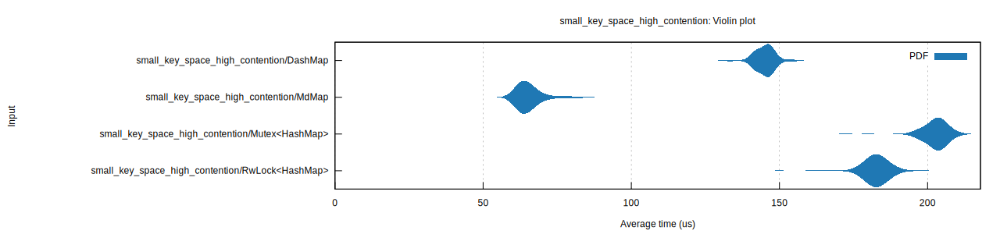

    

  <h2>MdMap</h2>
  

    MdMap is a lock-free multi-dimensional list which can replace e.g. HashMap or DashMap
    for fast concurrent/parallel access.
  

💥 UNSTABLE 💥   MdMap has not been thoroughly tested and is probably filled with bugs

## Performance

Items in MdMap are stored in a multi-dimensional linked list.
This makes it possible to achieve logarithmic search performance, and allow many threads to operate on the list in parallel.
An effect of this is that keys are sorted, which makes this suitable for things like priority queues.

Here are some _experimental_ and **INCREDIBLY BIASED** benchmarks, where we see that MdMap performs really when contention is high. One can imagine using `MdMap` for applications that have huge pressure on just a few keys.

**Disclaimer**: MdMap is still under development and I am working on improving its performance. Dashmap is faster for most workloads.

## Todo

- Does not yet support updating values
- Does not yet support the value `0` as the key, as this is reserved for the head
- Check for memory leaks
- Figure out a better hashing situation
- Test

## Based on these papers

- Zachary Painter, Christina Peterson, Damian Dechev. _Lock-Free Transactional Adjacency List._
- Deli Zhang and Damian Dechev. _An efficient lock-free logarithmic search data structure based on multi-dimensional list._
