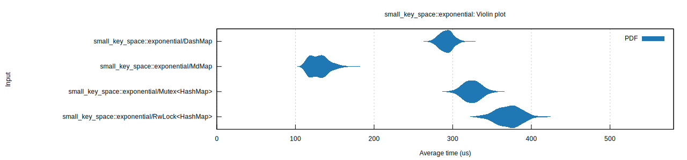

<div align="center">
  <br></br>

  <h1>🌌 MdMap</h1>
  <p>
    MdMap is a lock-free data structure that can act as a replacment for  e.g. Mutex&lt;HashMap&gt; or DashMap
  </p>

<sub>🚧 UNSTABLE 🚧 <br> MdMap has not been thoroughly tested and is likely filled with bugs</sub>

</div>

Items in MdMap are stored in a multi-dimensional linked list.
This makes it possible to achieve logarithmic search performance while allowing many threads to operate on the list in parallel.
An effect of the multi-dimensional list is that keys are sorted, which makes this suitable for things like priority queues.

## Performance

Other concurrent data structures builds on sharding (e.g. `DashMap`).
Doing this on a few keys, such as with an exponential key distribution can lead to a lot of lock contention and poor performance.

Skiplists is another alternative commonly used for concurrent data structures, however concurrency in
these can be limited under write-heavy loads.

MdMap uses multi-dimensional linked lists (which makes it more of a `MdTreeMap` perhaps) where scalar keys
acts as coordinates into the underlying structure. This has a couple of befits over other approaches, where MdMap doesn't require
balancing (seen in e.g. BSTs), randomization (e.g. skiplists) nor mutex-based locks (e.g. shard based).
This makes it quite fast under some loads compared to other solutions.

**Disclaimer**: MdMap is still under development and I am working on improving its performance. It's still pretty
slow for most workloads, but looks quite promising :)

### Benchmarks

Here are some _experimental_ and **INCREDIBLY BIASED** benchmarks, where we see that MdMap performs really when pressure is high on just a few keys.

---

**Exponential key distribution**

```
[config]
map size: 1000 entries (prefilled)
operation distribution: 98% get; 2% insert
operationg on: [672, 123, 493, 192, 12, 803, 366, 44, 982, 500]
executing: 3000 ops
key distribution: `exponential`
key distribution summary:
---------------------------------
| key |    ops     | percentage |
=================================
| 672 | ~    0 ops |    0.0078% |
| 123 | ~    0 ops |    0.0156% |
| 493 | ~    1 ops |    0.0546% |
| 192 | ~    4 ops |    0.1561% |
|  12 | ~   12 ops |    0.4214% |
| 803 | ~   34 ops |    1.1550% |
| 366 | ~   94 ops |    3.1450% |
|  44 | ~  256 ops |    8.5531% |
| 982 | ~  697 ops |   23.2558% |
| 500 | ~ 1897 ops |   63.2355% |
--------------------------------
```

| `MdMap`   | `DashMap` | `Mutex<HashMap>` | `RwLock<HashMap>` |
| --------- | --------- | ---------------- | ----------------- |
| 130.69 us | 291.98 us | 324.87 us        | 371.47 us         |



---

**Uniform key distribution**

```
[config]
map size: 1000 entries (prefilled with 0..1000)
operation distribution: 98% get; 2% insert
operationg on: [672, 123, 493, 192, 12, 803, 366, 44, 982, 500]
executing: 3000 ops
key distribution: `uniform`
key distribution summary:
---------------------------------
| key |    ops     | percentage |
=================================
| 672 | ~  300 ops |   10.0000% |
| 123 | ~  300 ops |   10.0000% |
| 493 | ~  300 ops |   10.0000% |
| 192 | ~  300 ops |   10.0000% |
|  12 | ~  300 ops |   10.0000% |
| 803 | ~  300 ops |   10.0000% |
| 366 | ~  300 ops |   10.0000% |
|  44 | ~  300 ops |   10.0000% |
| 982 | ~  300 ops |   10.0000% |
| 500 | ~  300 ops |   10.0000% |
--------------------------------
```

| `MdMap`   | `DashMap` | `Mutex<HashMap>` | `RwLock<HashMap>` |
| --------- | --------- | ---------------- | ----------------- |
| 129.94 us | 129.53 us | 324.38 us        | 373.86 us         |


## Todo

- Does not yet support updating values safely
- Does not yet support removing values safely
- Does not yet support the value `0` as the key, which is reserved for the head
- Check for memory leaks (some leaks are known)
- Figure out a better hashing situation
- Test

## Based on these papers

- Zachary Painter, Christina Peterson, Damian Dechev. _Lock-Free Transactional Adjacency List._
- Deli Zhang and Damian Dechev. _An efficient lock-free logarithmic search data structure based on multi-dimensional list._
